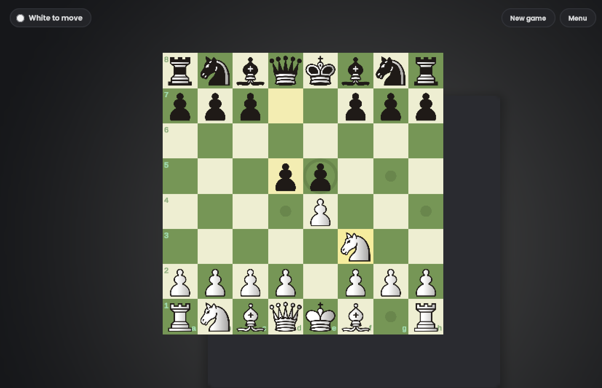

# Chess2D

A 2D chess game for two players on one computer, built in Unity.



## Features

- Full chess rules: castling, en passant, pawn promotion, check, checkmate, stalemate and the 50-move rule
- Legal move hints (dots for moves, rings for captures)
- Last move, selected piece and king-in-check highlighting
- Smooth piece movement
- Main menu, settings, promotion dialog and game-over screen (rematch, view board, back to menu)
- Settings, saved between sessions:
  - 6 board themes: Classic, Green, Blue, Purple, Pink, Night
  - 5 piece sets: Classic, Staunty, Merida, Chessnut, Pixel
  - toggles for board coordinates and move hints

## Requirements

- Unity **6000.6.2f1** (Unity 6), installed through Unity Hub

## Running the game

1. In Unity Hub go to **Projects → Add → Add project from disk** and pick this folder (`Chess2D`).
   If Hub says "No projects found", select the parent folder instead.
2. Open the project and the scene `Assets/Scenes/SampleScene.unity`.
3. Press **Play**.

The first launch takes a few minutes while Unity rebuilds the `Library` folder.

## Controls

| Action | Input |
|---|---|
| Select a piece / move | Left mouse button |
| Open the menu during a game | `Esc` or the **Menu** button |

## Project structure

```
Assets/
├── Scripts/
│   ├── PieceMover.cs          # input, move execution, check/checkmate/stalemate, castling, en passant, promotion
│   ├── ChessPiece.cs          # base class for pieces, legal moves, move animation
│   ├── Pawn.cs, Rook.cs, Knight.cs, Bishop.cs, Queen.cs, KIng.cs   # movement rules per piece
│   ├── BoardCreator.cs        # board, coordinates, themes, piece skins, reset
│   ├── LightAvaliableMoves.cs # board highlights (hints, last move, check)
│   ├── UIManager.cs           # all UI (UI Toolkit), created automatically at runtime
│   ├── GameSettings.cs        # board themes, piece sets, options (PlayerPrefs)
│   ├── SpriteFactory.cs       # procedurally generated sprites (dots, rings, frame)
│   └── EndGame.cs             # game-over entry points used by PieceMover
├── Editor/
│   └── PieceTextureImporter.cs  # import settings for piece textures
├── Resources/
│   ├── Pieces/<set>/          # piece sprites, e.g. wK.png, bQ.png (see LICENSES.md)
│   └── UI/                    # Chess.uss stylesheet, theme, Poppins font
└── Scenes/SampleScene.unity
```

The UI is built from code in `UIManager.cs` and styled with `Assets/Resources/UI/Chess.uss`.
It creates itself when the scene loads, so it doesn't need to be placed in the scene.

## Known limitations

- No draw by threefold repetition or insufficient material
- No AI opponent, no clock, no undo

## Credits

- Piece sets come from [lichess](https://github.com/lichess-org/lila) and keep their original licenses
  (GPLv2+, CC BY-NC-SA 4.0, Apache 2.0, AGPLv3+). Details are in `Assets/Resources/Pieces/LICENSES.md`.
- Font: [Poppins](https://fonts.google.com/specimen/Poppins), SIL Open Font License (`Assets/Resources/UI/Fonts/OFL.txt`).
